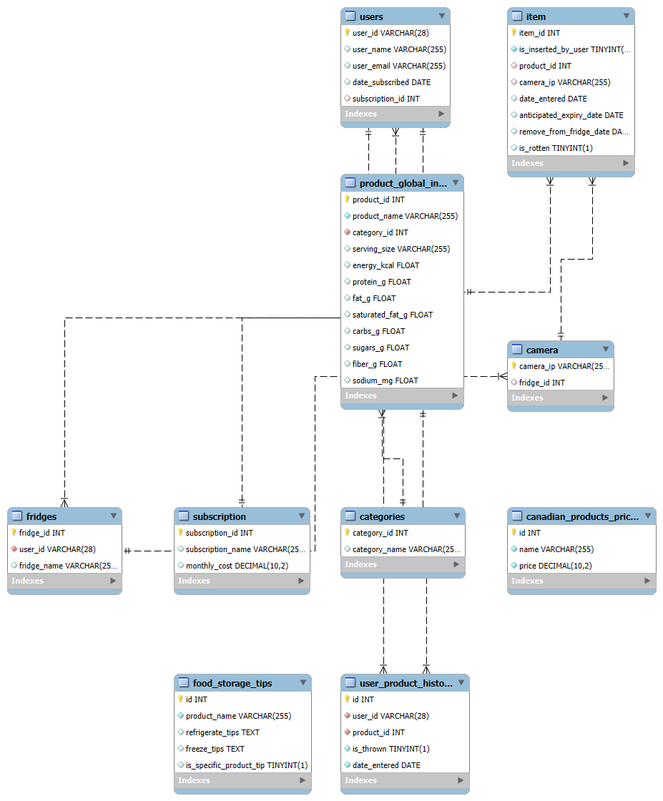

# FreshLens backend

## Table of Contents
- [Backend Overview](#backend-overview)
- [MySQL Database ER Scheme](#mysql-database-er-scheme)
- [Main Files Explanation](#main-files-explanation)

  

## Backend Overview   
The backend uses a MySQL database to accurately record updates from cameras—keeping track of item entries and changes in real time. At the same time, it stores fridge images in MongoDB, providing visual records of the fridge contents. The backend also performs waste analysis to identify patterns in discarded items, which helps in generating practical recommendations for better customer habits. Additionally, by integrating ChatGPT, it offers recipe suggestions based on foods that are nearing expiration, with the goal of minimizing waste.


## MySQL Database ER Scheme
```


```

## Main files explanation:

### `create_tables.py`
Purpose:
Sets up the MySQL database by creating (or dropping) tables and inserting demo data.
tables:
    subscription: Subscription plans and costs.
    users: User details and subscription linkage.
    fridges: User-associated fridge information.
    categories: Product category names.
    product_global_info: Detailed product data and nutrition info.
    camera: Camera details linked to fridges.
    item: Records of items detected in fridges.
    canadian_products_prices: Product pricing information.
    food_storage_tips: Storage advice for products.
    user_product_history: History of discarded items by users.

### `module_connect.py`
Listens for camera updates and applies changes to the database—adding new items, removing items, or updating item properties (like refined expiry dates) as needed.

### `handle_item_update.py`
This script is used by 'module.connect.py' to process camera updates. It implements the logic for inserting, updating, or archiving items based on the camera’s new data—comparing current database items with the incoming update.

### `chat.py`
This function uses OpenAI’s API to generate two recipes based on the given inventory, emphasizing ingredients nearing expiration. It loads the API key from environment variables with dotenv, constructs a detailed prompt including the current date and inventory data, and then calls the GPT‑3.5‑turbo model to generate and return the recipes.


### `camera_routes.py`
Provides an endpoint (/add_camera) to add a new camera record by validating input and inserting it into the database.

### `data_analysis_routes.py`
Offers several endpoints for data analysis:

/get_notifications generates expiry notifications based on items nearing expiration.
/get_nutritional_advice retrieves nutritional data for a user.
/get_shopping_cart_recommendations returns product recommendations based on predicted waste.
/get_waste_summary and /get_top_thrown_products provide waste analysis data grouped by week and the top three most discarded products, respectively.

### `fridge_routes.py`
Handles fridge-related operations such as:

Adding a fridge (/add_fridge),
Retrieving all fridges for a user,
Fetching a fridge's name, categories, products, and specific product items,
Obtaining product nutrient data, pricing, storage tips, and calculating a freshness score.

### `fridge_routes.py`
Retrieves the latest image for each camera associated with a user’s fridges and groups them by fridge.

### `item_routes.py`
Provides an endpoint (/insert_item) to insert a new item record into the database after validating and converting date fields.

### `recipe_routes.py`
Uses the inventory from a given fridge (fetched via an expiry query) and passes it to a ChatGPT-based function (generate_recipe) to generate two recipes. It then formats the output for structured JSON.

### `user_routes.py`
Contains endpoints for user management tasks, including checking if a user is already known, updating user subscriptions, and signing up new users.


