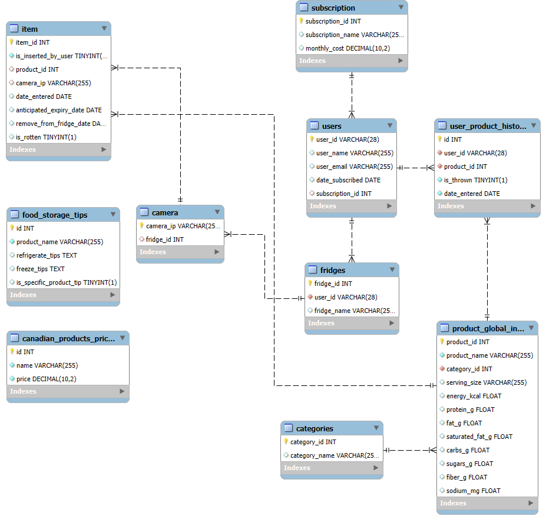

# FreshLens backend

## Table of Contents
- [Backend Overview](#backend-overview)
- [MySQL Database ER Scheme](#mysql-database-er-scheme)
- [MySQL Database explanation](#mysql-database-explanation)
- [Main Files](#main-files)

## Backend Overview   
The backend uses a MySQL database to accurately record updates from cameras—keeping track of item entries and changes in real time. At the same time, it stores fridge images in MongoDB, providing visual records of the fridge contents. The backend also performs waste analysis to identify patterns in discarded items, which helps in generating practical recommendations for better customer habits. Additionally, by integrating ChatGPT, it offers recipe suggestions based on foods that are nearing expiration, with the goal of minimizing waste.

## MySQL Database ER Scheme

## MySQL Database explanation

### **subscription**
- **Purpose:** Stores the available subscription plans.
- **Key Columns:**
  - `subscription_id` (INT, AUTO_INCREMENT, PRIMARY KEY) – Unique identifier for each subscription.
  - `subscription_name` (VARCHAR(255)) – Name (e.g., free, plus, premium).
  - `monthly_cost` (DECIMAL(10,2)) – Monthly price.

---

### **users**
- **Purpose:** Contains registered user data.
- **Key Columns:**
  - `user_id` (VARCHAR(28), UNIQUE, PRIMARY KEY) – Unique user ID.
  - `user_name` (VARCHAR(255)) – Full name.
  - `user_email` (VARCHAR(255)) – Email address.
  - `date_subscribed` (DATE) – Date of subscription.
  - `subscription_id` (INT) – Foreign key linking to `subscription`.

- **Global User Context & Firebase Integration:**
  We have implemented Firebase authentication using Google as our identity provider. Upon successfully connecting to Firebase, we verify whether the user already exists in   our system. If the user is new, we add them to our users table—this process is handled in our "firebas.ts" file. Once authenticated, the user's information is stored in     a global context, making it accessible throughout the entire application.
---

### **fridges**
- **Purpose:** Represents a user's fridge.
- **Key Columns:**
  - `fridge_id` (INT, AUTO_INCREMENT, PRIMARY KEY) – Unique fridge ID.
  - `user_id` (VARCHAR(28)) – Foreign key from `users`.
  - `fridge_name` (VARCHAR(255)) – Fridge name (e.g., "my home fridge").

---

### **categories**
- **Purpose:** Lists product categories.
- **Key Columns:**
  - `category_id` (INT, AUTO_INCREMENT, PRIMARY KEY) – Unique category ID.
  - `category_name` (VARCHAR(255)) – Category name (e.g., Dairy, Fruits).

---

### **product_global_info**
- **Purpose:** Stores detailed product information.
- **Key Columns:**
  - `product_id` (INT, AUTO_INCREMENT, PRIMARY KEY) – Unique product ID.
  - `product_name` (VARCHAR(255), NOT NULL) – Product name.
  - `category_id` (INT, NOT NULL) – Foreign key from `categories`.
  - Other columns (nullable): `serving_size`, `energy_kcal`, `protein_g`, `fat_g`, `saturated_fat_g`, `carbs_g`, `sugars_g`, `fiber_g`, `sodium_mg`.

  - **Product Nutritional Values & USDA API Integration:**
  When we add a new product, we query the USDA API using the product's name to grab its nutritional info.
  It then extracts key nutrients—like energy, protein, fats, carbs, sugars, fiber, and sodium—and adjusts the values to a per-100g basis using the provided serving size.   
  If the API doesnt returns an error we store the standardized nutritional data in product_global_info table.

---

### **camera**
- **Purpose:** Maps a camera to a fridge.
- **Key Columns:**
  - `camera_ip` (VARCHAR(255), PRIMARY KEY) – Camera IP address.
  - `fridge_id` (INT) – Foreign key from `fridges`.

---

### **item**
- **Purpose:** Records items detected in a fridge.
- **Key Columns:**
  - `item_id` (INT, NOT NULL, UNIQUE, PRIMARY KEY) – Unique item ID.
  - `is_inserted_by_user` (BOOLEAN, NOT NULL) – Indicates if manually inserted.
  - `product_id` (INT) – Foreign key from `product_global_info`.
  - `camera_ip` (VARCHAR(255)) – Foreign key from `camera`.
  - `date_entered` (DATE) – Date of entry.
  - `anticipated_expiry_date` (DATE) – Expected expiry date.
  - `remove_from_fridge_date` (DATE) – Reccomended Removal date (for now same as expiry date but in future models a more accurate estimation will be possible).
  - `is_rotten` (BOOLEAN) – Indicates if the item is considered rotten.

---

### **canadian_products_prices**
- **Purpose:** Stores Canadian pricing data.
- **Key Columns:**
  - `id` (INT, AUTO_INCREMENT, PRIMARY KEY) – Unique record ID.
  - `name` (VARCHAR(255), NOT NULL) – Product name.
  - `price` (DECIMAL(10,2), NOT NULL) – Price.

---

### **food_storage_tips**
- **Purpose:** Provides food storage tips.
- **Key Columns:**
  - `id` (INT, AUTO_INCREMENT, PRIMARY KEY) – Unique tip ID.
  - `product_name` (VARCHAR(255), NOT NULL) – Name of product.
  - `refrigerate_tips` (TEXT) – Tips for refrigeration.
  - `freeze_tips` (TEXT) – Tips for freezing.
  - `is_specific_product_tip` (BOOLEAN) – Indicates if tip is specific.

---

### **user_product_history**
- **Purpose:** Tracks user history for products (e.g., if an item was thrown away).
- **Key Columns:**
  - `id` (INT, AUTO_INCREMENT, PRIMARY KEY) – Unique history record.
  - `user_id` (VARCHAR(28), NOT NULL) – Foreign key from `users`.
  - `product_id` (INT, NOT NULL) – Foreign key from `product_global_info`.
  - `is_thrown` (BOOLEAN, NOT NULL) – Indicates if the item was thrown.
  - `date_entered` (DATE, NOT NULL) – Date when the record was created.
 

## Main Files

### `module_connect.py`
Listens for camera updates and applies changes to the database—adding new items, removing items, or updating item properties (like refined expiry dates) as needed.

### `handle_item_update.py`
This script is invoked by `module_connect.py` to process camera updates. It implements the logic for inserting, updating, or archiving items based on the camera’s new data by comparing current database items with the incoming update.

### `chat.py`
Uses OpenAI’s API to generate two recipes based on the given inventory, emphasizing ingredients nearing expiration. It loads the API key from environment variables using dotenv, constructs a detailed prompt (including the current date and inventory data), and calls the GPT‑3.5‑turbo model to generate and return the recipes.

### `camera_routes.py`
Provides an endpoint (`/add_camera`) to add a new camera record. It validates the input and inserts the camera data into the database.

### `data_analysis_routes.py`
Offers several endpoints for data analysis:
- **/get_notifications** – Generates expiry notifications for items nearing expiration.
- **/get_nutritional_advice** – Retrieves nutritional data for a user.
- **/get_shopping_cart_recommendations** – Returns product recommendations based on predicted waste.
- **/get_waste_summary** and **/get_top_thrown_products** – Provide waste analysis data grouped by week and the top three most discarded products, respectively.

### `fridge_routes.py`
Handles fridge-related operations such as:
- Adding a fridge (`/add_fridge`).
- Retrieving all fridges for a user.
- Fetching a fridge's name, categories, products, and specific product items.
- Obtaining product nutrient data, pricing, storage tips, and calculating a freshness score.
- Retrieving the latest image for each camera associated with a user’s fridges and grouping them by fridge.

### `item_routes.py`
Provides an endpoint (`/insert_item`) to insert a new item record into the database after validating and converting date fields.

### `recipe_routes.py`
Uses the inventory from a given fridge (fetched via an expiry query) and passes it to a ChatGPT-based function (`generate_recipe`) to generate two recipes. The output is then formatted as structured JSON.

### `user_routes.py`
Contains endpoints for user management tasks, including checking if a user already exists, updating user subscriptions, and signing up new users.

